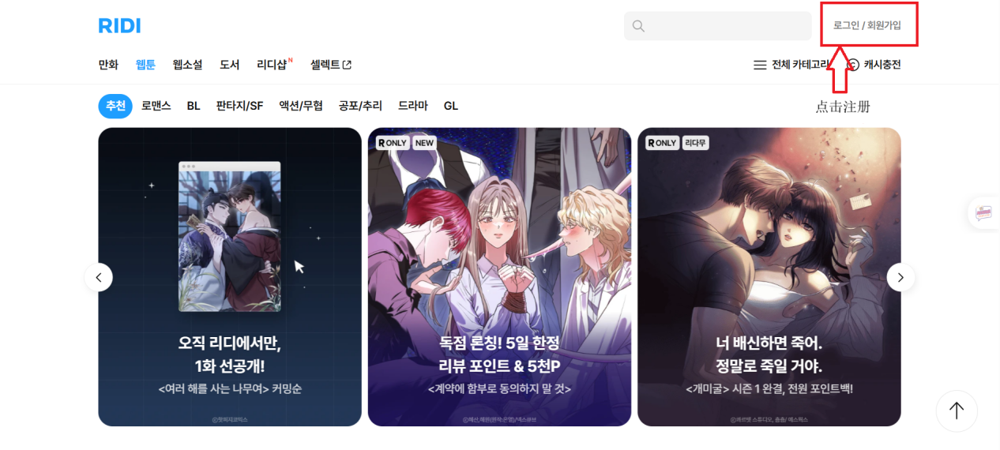
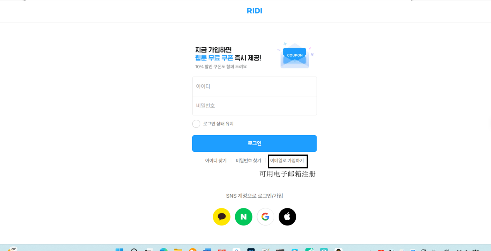
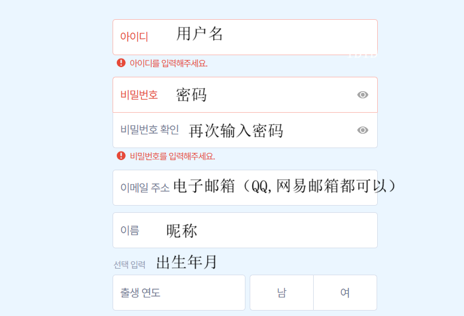
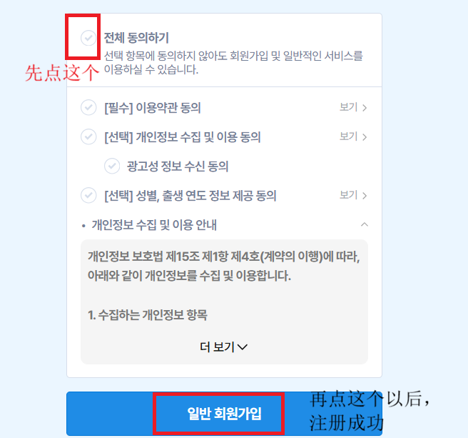
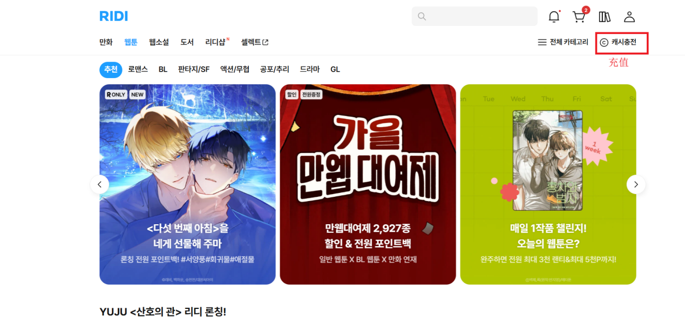
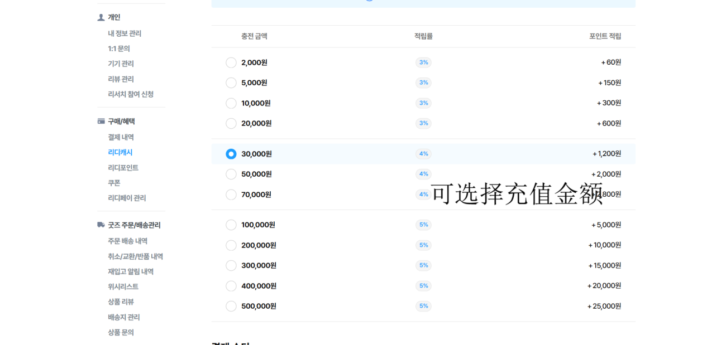
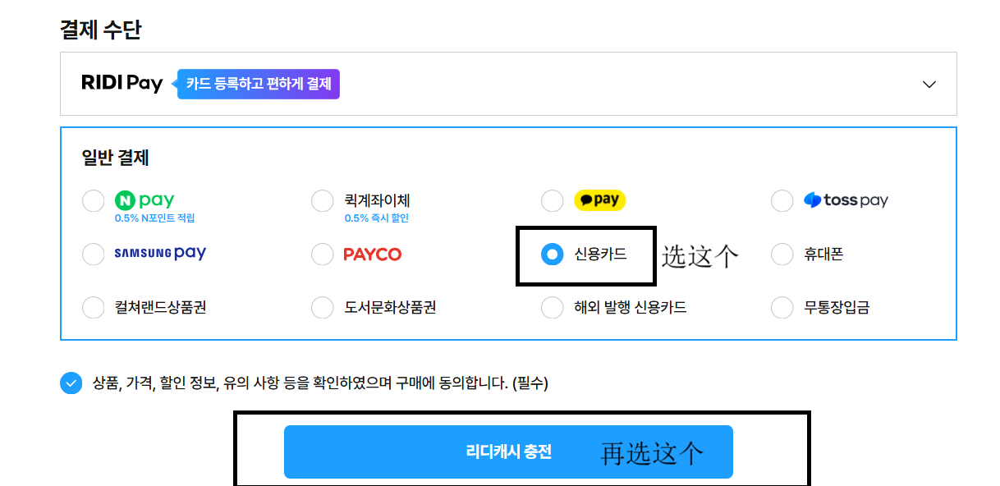
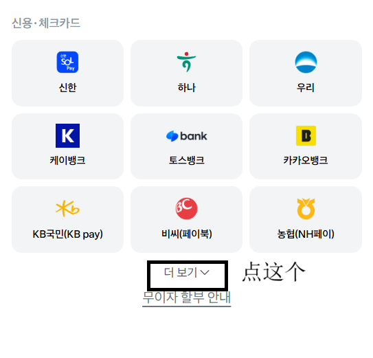
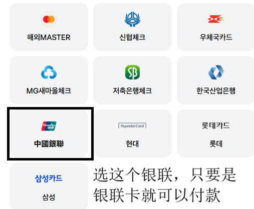

本站汉化仅供学习交流。如果你喜欢某部作品，强烈建议到**官方平台**支持原作者——正版收益会直接给到原作者，画质最好、更新最快。


本站作品对应的官方平台有 **RIDIBOOK、Lezhin、MrBlue、DLsite** 四个，下面逐个讲清注册、充值、付费和阅读。具体作品对应哪个平台，以各作品页标注为准。


## 平台总览

| 平台 | 类型 | 语言 | 付款方式 |
|---|---|---|---|
| RIDIBOOK | 韩国电子书 / 漫画 | 韩文 | 韩信用卡 / Kakao Pay |
| Lezhin | 韩国漫画（BL / 成人强项） | 英 / 日 / 韩 | 信用卡（Lezhin Coin） |
| MrBlue | 韩国漫画 / 小说（独家 BL） | 韩文 | Google Pay / 信用卡 |
| DLsite | 日本数字作品（漫画 / 游戏 / 音声） | 日文 + 中文界面 | 信用卡 / PayPal / 点数 |

---

## RIDIBOOK（Ridibooks / Ridistory）

韩国最大的电子书平台，漫画业务叫 **Ridistory**，BL 专区（RIDI ONLY）很全。

- **注册**：邮箱即可
- **付费**：韩信用卡 / 礼品卡 / Kakao Pay，**国内银联卡也能充**
- **语言**：韩文，需配合翻译
- **适合**：能搞定韩国支付方式的读者

  

    ❖
    RIDIBOOKS 注册 &amp; 充值图文教程
    »
  

  

    全程只用浏览器，<code>邮箱注册</code>、<code>无需19+认证</code>、<code>银联卡可充值</code>。
    点开下面的步骤照着做即可；<b>截图里的韩文位置都标了中文说明</b>，点图片可以看大图。
  

  

    
第一步：注册账号（约 2 分钟）

    

      
1. 打开 RIDIBOOKS 官网 <a href="https://ridibooks.com/webtoon/recommendation" target="_blank" rel="noopener">ridibooks.com</a>，点右上角的 <b>로그인/회원가입（登录/注册）</b>：

      
      
2. 在登录页点下方的 <b>이메일로 가입하기（用电子邮箱注册）</b>；用 Kakao / Naver / Google / Apple 账号直接登录也可以：

      
      
3. 填写注册表单，对照下图：아이디 = 用户名，비밀번호 = 密码（输两遍），이메일 주소 = 电子邮箱（<b>QQ、网易邮箱都可以</b>），이름 = 昵称；出生年月可跳过：

      
      
4. 同意条款：先勾上 <b>전체 동의하기（全部同意）</b>，再点 <b>일반 회원가입（普通注册）</b>，注册完成：

      
      
✔ 注册完成即可看漫画 —— RIDIBOOKS 已取消 19+ 成人认证，不需要再额外验证。

    

  

  

    
第二步：充值 RIDI 币（支持国内银联卡）

    

      
1. 注册完成后回到首页（见下图），点右上角的 <b>캐시충전（充值）</b>：

      
      
2. 在「리디캐시」页选一个充值金额（充得越多赠币越多）：

      
      
3. 结算方式选 <b>신용카드（信用卡）</b>，然后点 <b>리디캐시 충전（RIDI 币充值）</b>按钮：

      
      
4. 在银行卡列表里点 <b>더 보기（展开更多）</b>：

      
      
5. 选 <b>중국은련（中国银联）</b> —— 只要你的卡带「银联」标志就能付款：

      
      
✔ 充值到账后，回到漫画页用 RIDI 币解锁单话即可阅读。

    

  

---

## Lezhin（Lezhin Comics）

韩国老牌漫画平台，BL 和成人题材是强项，**有英文版**。

- **注册**：邮箱即可，海外用户注册英文版（lezhinus.com）
- **付费**：用「Lezhin Coin」购买付费章节，信用卡支付
- **语言**：APP 与网页版可切换英语 / 日语 / 韩语
- **注意**：成人向内容需年龄认证，主要在网页端浏览

---

## MrBlue（미스터블루）

韩国正版漫画 / 小说平台（Mr. Blue Corporation），独家 BL + 海量韩漫，webtoon 与网络小说全覆盖。

- **注册**：Google / Facebook / 邮箱登录，新用户注册送 1000 韩元
- **免费渠道**：每日免费券、每日签到送硬币、节日活动
- **付费**：用「코인 硬币」购买，1코인≈1 韩元，单章约 20–50코in；也有订阅制（约 5000 韩元/月，大部分作品无限看）
- **充值**：Google Pay 等
- **注意**：成人向（TL）作品需成人认证，可能要求护照；韩文为主，部分内容有锁区限制

---

## DLsite

日本最大的数字作品下载销售平台，涵盖**漫画、游戏、音声、CG、小说**，有中文界面。

- **注册**：邮箱即可
- **付费**：信用卡 / PayPal / DLsite Points（点数充值常有优惠）
- **特点**：漫画多为下载型（图片包 / PDF），也有在线观看；同人与商业作品都有


国内粉丝付费门槛最低的是 **Lezhin（英文版 + 信用卡）** 和 **DLsite（中文界面 + 信用卡/PayPal）**；RIDIBOOK 和 MrBlue 需要韩国支付方式或护照认证，门槛较高。


---

## 常见问题

- **一定要韩国手机号吗**：这四个平台都只需邮箱注册；RIDIBOOKS 已取消 19+ 成人认证；MrBlue 的成人向内容认证可能另需护照
- **哪个付款最方便**：Lezhin、DLsite 信用卡 / PayPal 最通用；**RIDIBOOKS 支持国内银联卡**（见上方图文教程）；MrBlue 需韩国支付渠道
- **有中文吗**：仅 DLsite 有中文界面；Lezhin 有英文版；RIDIBOOK、MrBlue 为韩文


具体作品在哪个平台连载、购买方式搞不定，欢迎到[关于本站](/about/)留言，我看到会补。


## 版权声明

本站所有汉化作品仅供**个人学习、交流与研究**使用。所有作品著作权归原作者及出版方所有，请通过官方渠道支持正版。
